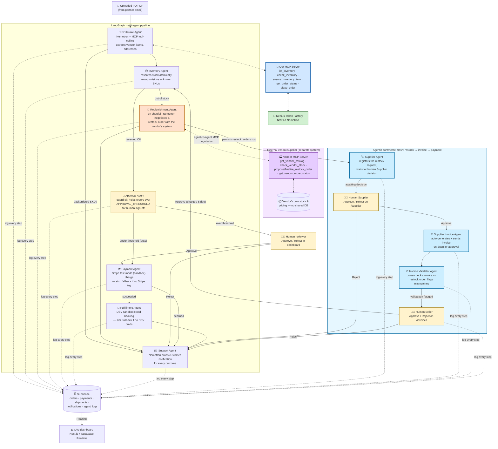
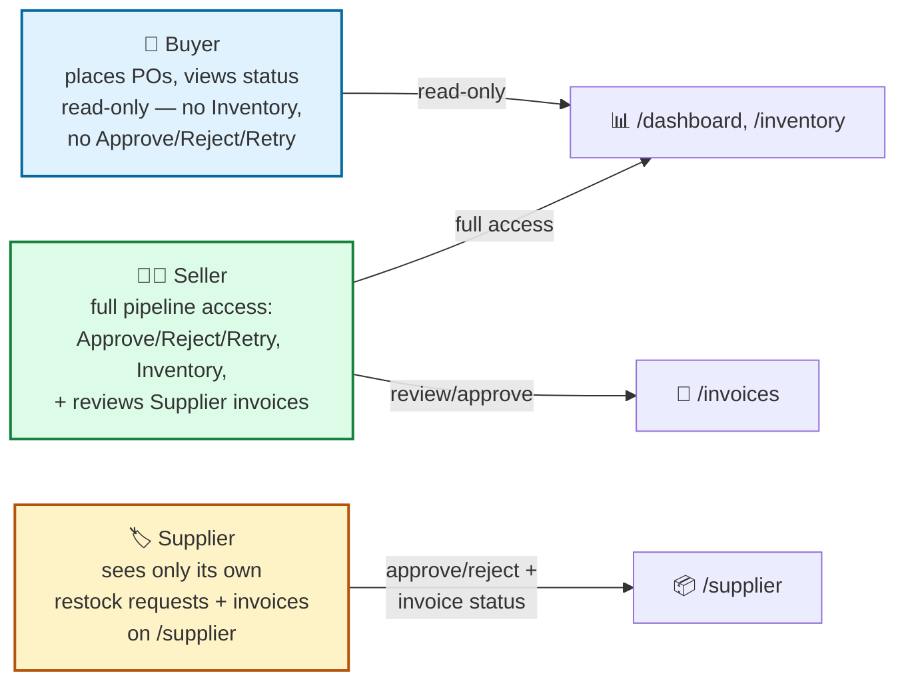
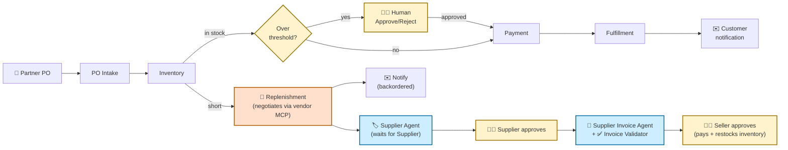

# AutoCom — Architecture Diagram (Slide 5 source)

This is a [Mermaid](https://mermaid.js.org/) diagram — GitHub, VS Code (Markdown Preview Mermaid Support
extension), and Notion render it natively. To export a PNG/SVG for a slide deck:

1. Paste the code block below into **https://mermaid.live** → "Actions" → "Export as PNG/SVG", or
2. `npm install -g @mermaid-js/mermaid-cli` then:
   ```
   mmdc -i ARCHITECTURE_DIAGRAM.md -o architecture.png -b transparent -s 3
   ```
   (mmdc reads the first ```mermaid fenced block in a markdown file)

> **Note:** `architecture-simple.png`, `architecture-personas.png`, and
> `architecture-detailed.png` in this folder are rendered from the diagrams
> below (including the persona/agentic-commerce-mesh update) via
> `@mermaid-js/mermaid-cli` (`mmdc -i <file>.mmd -o <file>.png -b transparent
> -s 3`). Regenerate them the same way if you edit the diagrams further.

---

## Full pipeline + guardrail + vendor restock + audit trail



---

## Persona access model: Buyer / Seller / Supplier

Every screen and API route is gated server-side by a `profiles.role` lookup
(`requireRole` middleware) — the frontend nav/redirects are UX convenience,
not the security boundary.



---

## Simplified version (if the full diagram is too dense for a slide)


